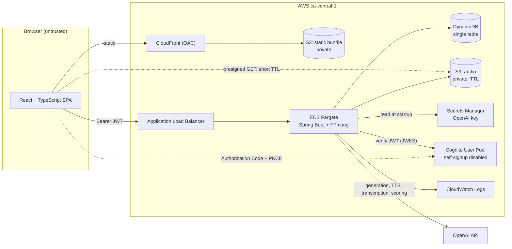
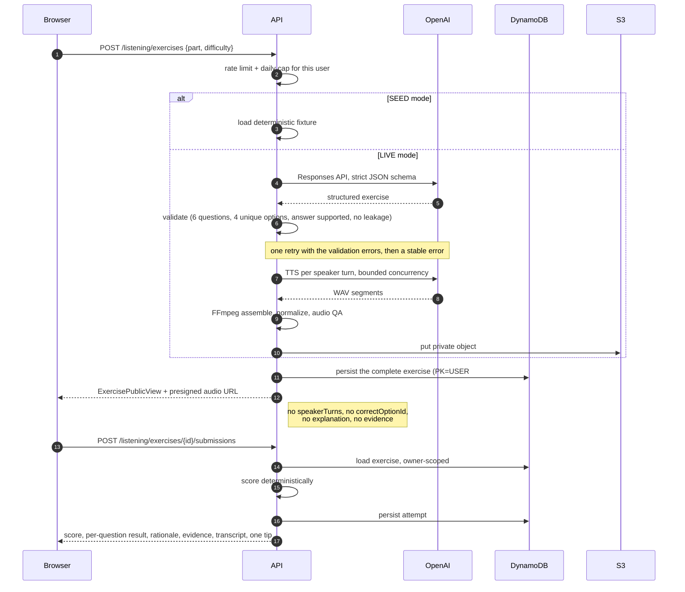
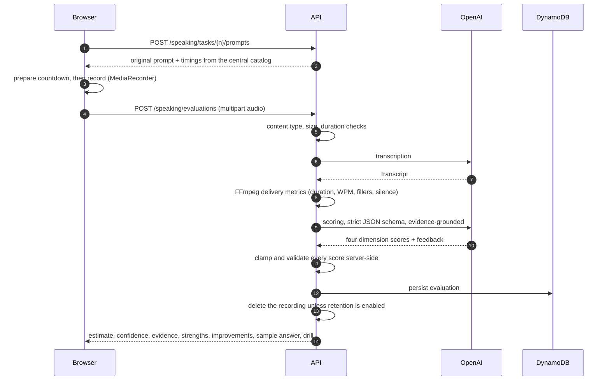

# Architecture

## System

## Trust boundaries

| Boundary                | What crosses it                                      | Control                                                                  |
| ----------------------- | ---------------------------------------------------- | ------------------------------------------------------------------------ |
| Browser → API           | User answers, recordings, task selections            | Cognito JWT, strict CORS allowlist, bean validation, per-user rate limits |
| API → OpenAI            | Prompts, transcripts, recordings                      | Server-side key from Secrets Manager, timeouts, bounded retries           |
| API → S3/DynamoDB       | Exercises, evaluations, audio                         | Least-privilege task role scoped to one table and one bucket prefix       |
| Browser → S3 (audio)    | Generated audio bytes                                 | Presigned GET only, short expiry, issued to the authenticated owner       |
| Internet → Fargate task | Nothing                                               | Security group permits inbound only from the ALB security group           |

The browser never holds a provider key, never receives another user's data, and never receives an
answer key before submission.

## Request flows

### Listening: generate → practise → submit

### Speaking: record → transcribe → evaluate

## Data design

Single table, on-demand billing, TTL attribute `expiresAt`.

| Item                | PK             | SK                                            | TTL |
| ------------------- | -------------- | --------------------------------------------- | --- |
| Listening exercise  | `USER#{sub}`   | `EXERCISE#{exerciseId}`                       | yes |
| Listening attempt   | `USER#{sub}`   | `LISTENING_ATTEMPT#{createdAt}#{attemptId}`   | no  |
| Speaking evaluation | `USER#{sub}`   | `SPEAKING_EVALUATION#{createdAt}#{evalId}`    | no  |
| Daily usage counter | `USER#{sub}`   | `USAGE#{yyyy-mm-dd}`                          | yes |

Every access pattern is a single-partition query. Binary audio is never stored in DynamoDB; the
item holds only the S3 key.

## Data lifecycle

| Data                  | Where                | Retention                                            |
| --------------------- | -------------------- | ---------------------------------------------------- |
| Generated exercise    | DynamoDB             | TTL, default 30 days                                  |
| Generated audio       | S3 `listening/`      | Lifecycle expiry, 7 days in dev                       |
| Speaking recording    | S3 `speaking/`       | Deleted after evaluation by default; 1-day lifecycle as a backstop |
| Transcript + feedback | DynamoDB             | Kept until the user deletes it                        |
| Local temp files      | container filesystem | Deleted in a `finally` block, always                  |

## Key trade-offs

**No NAT Gateway.** A NAT Gateway is roughly the cost of the rest of this stack combined, purely to
give one container outbound access to OpenAI. Instead the Fargate task runs in a public subnet with
a public IP for egress, while its security group accepts inbound traffic only from the ALB security
group. The container is not reachable from the internet; it is only able to reach out. If this app
ever grew a compliance requirement for fully private subnets, the fix is a NAT Gateway or VPC
endpoints, and the cost changes accordingly.

**Synchronous listening generation first.** Generation plus TTS plus assembly is the slowest path in
the app. It starts synchronous because that is far simpler, and it is refactored into a
`PENDING → GENERATING → READY → FAILED` job with client polling only if measured latency actually
exceeds a practical HTTP timeout. No queue and no second always-on worker is introduced on
speculation.

**Single stack.** See ADR-007.

**SEED mode everywhere.** See ADR-005. It is why CI, e2e, and a fresh clone all work with no API key.
